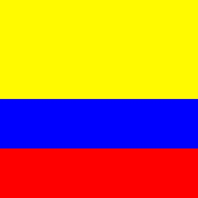

# Estructura de un juego en pygame

## Inicializacion

como en todo programa en python, se deben importar los modulos o librerias a utilizar.

`import pygame`

- inicializar pygame usando la funcion init(). Inicializa todos los modulos de pygame importados.

``pygame.init()``

## Visualizacion de la ventanz

``ventana= pygame.display.set_mode((600,400))``

- set_mode es la funcon encargada de definir el tamaño de la ventana. En el ejemplo se esta definiendo una ventana de 600 pixeles de ancho y 400 pixeles de alto. 

``pygame.display.set_caption("mi ventana")``

- set_caption es la funcion que añade un titulo a la ventana.

### Funcion set_mode()

``set_mode(size =(0,0), flags = 0, depth = 0, display = 0)``

- size = (600,400) : define el tamaño de la ventana
- flags : define uno o mas comportamientos para la ventana
    - valores:
        - pygame.FULLSCREEN
        - pygame.RESIZABLE
    - Ejemplo:
        - flags = pygame.FULLSCREEN | pygame.RESIZABLE: pantalla completa, dimensiones modificables.

## Bucle de juego - game loop

- bucle infinito quese interrumpira al cumplir ciertos criterios 

- reloj interno del juego

- en cada interacion del buce del juego podemos mover a un personaje, o tener en cuenta que un objeto a alcanzado a otro, o que se a cruzado la linea de llegada lo que quiere decir que la partida ha terminado.

- cada iteracion es una oportunidad para actualizar todos los datos relacionados con el estado de la partida.

- en cada iteracion se realisan las siguientes tareas:
    1. comprobar que no se alcanzan las condiciones de parada, en cuyo caso se interrumpe el bucle.
    2. Actualizar los recursos necesarios para la iteracion actual
    3. Obtener las entradas del sistemas, o de interaccion con el jugador.
    4. actualizar todas las identidades que
    caracterizan el juego.
    5. refrescar la pantalla.

## Superficies pygame

- Superficie: 
    - elemento geometrico 
    - linea , poligono, imagen, texto, que se muestra en la pantalla.
    - El poligono se puede o no rellenar de color.
    - Las supericies se crean de diferente manera dependiendo del tipo:
        - imagen: image.load()
        - texto: font.render()
        - superficie generica: con pygame.surface()
        - ventana del juego: pygame.display.set_mode()

## Ejemplo Con la bandera de colombia
```
# Importamos la librería pygame
import pygame
import random

# Colores aleatorios
amarillo = (255, 250, 0)
azul = (0, 0, 255)
rojo = (255, 0, 0)

# Inicializamos los módulos de pygame
pygame.init()

# Establecer título a la ventana
pygame.display.set_caption("bandera de colombia")

# Establecemos las dimensiones de la ventana
ventana = pygame.display.set_mode((400, 400))

# Creamos una superficie con el tamaño adecuado (por ejemplo, 300x300)
color_amarillo = pygame.Surface((400, 200))
color_azul = pygame.Surface((400, 100))
color_rojo = pygame.Surface((400, 100))

# Rellenamos la superficie con el color aleatorio
color_amarillo.fill((amarillo))
color_azul.fill((azul))
color_rojo.fill((rojo))

# Insertamos o movemos la superficie en la ventana

ventana.blit(color_amarillo, (0, 0))
ventana.blit(color_azul, (0, 200))
ventana.blit(color_rojo, (0, 300))

# Actualizamos la visualización de la ventana
pygame.display.flip()

# Bucle del juego
while True:
    event = pygame.event.wait()
    if event.type == pygame.QUIT:
        break

pygame.quit()
```

